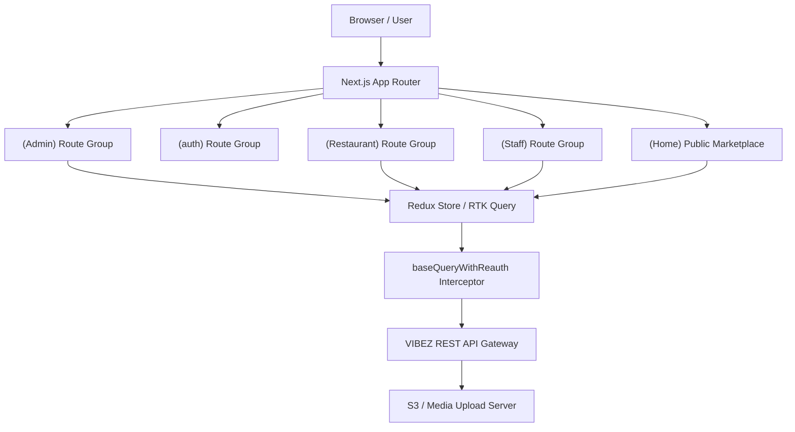

# VIBEZ - Restaurant Booking, Marketing & Marketplace Management Portal

[](https://getvibez.app/)


---

## 🚀 **[Visit Live Production Site: getvibez.app](https://getvibez.app/)**

> ### 🌐 **[https://getvibez.app/](https://getvibez.app/)**

---

VIBEZ is an enterprise-grade, modern SaaS platform designed to bridge the gap between restaurant entities, booking patrons, and marketing affiliate partners. The VIBEZ Portal enables platform administrators to control marketplace operations and lets restaurant owners manage daily floor operations, bookings, menus, marketing videos, staff scheduling, and performance analytics.

---

## 📖 Table of Contents

1. [System Architecture Overview](#-system-architecture-overview)
2. [Role-Based Feature Specifications](#-role-based-feature-specifications)
    - [1. Public Landing & Consumer Portal (`(Home)`)](#1-public-landing--consumer-portal-home)
    - [2. Restaurant Onboarding & Partnership Application (`/partner`)](#2-restaurant-onboarding--partnership-application-partner)
    - [3. Platform Administrators (`(Admin) /admin`)](#3-platform-administrators-admin-admin)
    - [4. Restaurant Owners (`(Restaurant) /dashboard`)](#4-restaurant-owners-restaurant-dashboard)
    - [5. Restaurant Staff Portal (`(Staff) /staff`)](#5-restaurant-staff-portal-staff-staff)
    - [6. Authentication & Account Recovery (`(auth)`)](#6-authentication--account-recovery-auth)
3. [Technical Architecture & State Flow](#-technical-architecture--state-flow)
    - [RTK Query Engine & Feature Slices](#1-rtk-query-engine--feature-slices)
    - [Seamless Re-Authentication Interceptor](#2-seamless-re-authentication-interceptor)
    - [Media Upload & Dynamic Resolution Core](#3-media-upload--dynamic-resolution-core)
4. [Tech Stack Matrix](#-tech-stack-matrix)
5. [Complete Directory Layout](#-complete-directory-layout)
6. [Local Setup & Environment Guide](#-local-setup--environment-guide)
7. [Production Build & Deployment Guidelines](#-production-build--deployment-guidelines)
8. [Troubleshooting & FAQ](#-troubleshooting--faq)

---

## 🏗️ System Architecture Overview

VIBEZ operates on a split-portal layout powered by Next.js **App Router** groups. By isolating routes into layout groups like `(Admin)`, `(Restaurant)`, `(Staff)`, `(Home)`, and `(auth)`, the system separates layout contexts and limits bundle sizes per portal. Data hydration and synchronization are managed via an RTK-based centralized state store, maintaining a single source of truth across all modules.



---

## 🚀 Role-Based Feature Specifications

### 1. Public Landing & Consumer Portal (`(Home)`)

The consumer-facing portal introduces the VIBEZ ecosystem and allows diners to explore partner restaurants, deals, and FAQs.

- **Hero & Value Proposition Section (`/`)**: Engaging landing layout showcasing partner benefits, interactive stats, member perks, and app download links.
- **Restaurant Marketplace Explorer (`/restaurant`)**: Browse partner venues, filter by cuisine types, search by keyword, and view detailed venue profiles.
- **Frequently Asked Questions (`/faq`)**: Fully responsive FAQ accordion covering partnership costs, deal mechanics, onboarding timelines, and membership queries.
- **Blog & News Hub (`/blogs`)**: Platform articles, dining guides, and restaurant success stories.
- **Success & Confirmation Pages (`/success`)**: Dedicated landing state post-registration or partner application submission.

---

### 2. Restaurant Onboarding & Partnership Application (`/partner`)

An interactive multi-step onboarding wizard for prospective restaurant partners with Google Places autocomplete integration.

- **Google Places Autocomplete**: Real-time establishment address lookup that auto-populates street name, city, state, zip code, country, and precise latitude/longitude coordinates.
- **Multi-Select Taxonomy Dropdowns**: Choose multiple cuisine types (e.g. Italian, Swiss, Indian, Thai, Kebab, Vegan) and food categories (Pizza, Burger, Sushi, Seafood).
- **Day & Slot Opening Hours Configurator**: Interactive day-by-day scheduler (`Mon` - `Sun`) with toggles for **Lunch** and **Dinner** slots, including customized open/close time pickers for each slot.
- **Media Assets Uploader**: Upload owner profile avatar, main venue cover image, and multi-file gallery image previews with real-time file deletion controls.
- **Automated Validation & Account Creation**: Validates required inputs, enforces minimum open-day thresholds, creates restaurant accounts, dispatches auth tokens to Redux, and redirects to the owner dashboard.

---

### 3. Platform Administrators (`(Admin) /admin`)

Administrators manage platform-wide configurations, billing models, listing verifications, and marketplace metrics.

- **Dynamic Stats Board (`/admin`)**: Live tracking of overall platform revenue (Monthly vs. Annual), active subscribers, payment failures, upcoming renewals, and partner payout distributions using interactive charts.
- **Subscription Engine (`/admin/user-plans`)**: Create and update pricing structures (`MONTHLY`, `HALF_YEARLY`, `YEARLY`). Admins can toggle free trials, define trial day lengths, and manage billing plans.
- **Partner Referral & Commissions Ledger (`/admin/referrals`)**: Oversee affiliate codes, track referrers, calculate commission percentages (e.g. `percentOff` discounts), and manage manual withdrawal payouts.
- **Listing Onboarding & Moderation (`/admin/restaurants`)**: Audit restaurant listing submissions, suspend non-compliant owners, approve pending venues, and manage category listings.
- **Users Management (`/admin/users`)**: Audit platform user accounts, toggle roles, inspect subscription statuses, and restrict unauthorized access.
- **System Coupons & Deals (`/admin/coupons` & `/admin/deals`)**: Setup platform-wide seasonal promotional campaigns, customize target discounts, and monitor usage metrics.
- **Payout Withdrawals (`/admin/withdrawals`)**: Review partner payout requests, verify banking details, process approvals, or reject flagged transactions.
- **Platform System Settings (`/admin/settings`)**: Global admin configurations and operational parameters.

---

### 4. Restaurant Owners (`(Restaurant) /dashboard`)

A complete system for managing a physical restaurant branch and its online marketplace presence.

- **Dashboard Home (`/dashboard`)**: High-level overview of daily reservations, total revenue, recent bookings, and quick action shortcuts.
- **Analytics & Booking Visualizers (`/dashboard/analytics`)**: Live dashboard displaying reservations, peak booking hours, weekly visitor statistics, and customer metrics using responsive graphs.
- **Table Reservator & Calendar (`/dashboard/bookings`)**: Real-time management of reservation schedules, seating capacities, guest lists, and walk-in updates.
- **Short-Form Video Channels (`/dashboard/video`)**: Upload promotional short-form marketing videos ("Shorts") directly to the client feed to boost local customer interest.
- **Shift & Staff Scheduling (`/dashboard/staff` & `/dashboard/schedule`)**: Add staff members (Managers, Hosts, Waiters), assign shifts, manage work logs, and track staff schedules.
- **Performance Monitoring (`/dashboard/performance`)**: Key performance indicators, customer feedback scores, order processing turnaround times, and table turnover metrics.
- **Promotions & Deals (`/dashboard/deals`)**: Custom restaurant-specific dining offers, happy hour promos, and discount vouchers.
- **Restaurant Settings & Map Location (`/dashboard/settings`)**: Define restaurant location coordinates using map overlays (powered by React Leaflet) so users can locate venues easily.

---

### 5. Restaurant Staff Portal (`(Staff) /staff`)

- **Shift Calendars & Duty Workspace (`/staff`)**: Clean, lightweight visual workspace for on-duty staff to review assignations, shift duties, and operational task lists.
- **Reservation Check-ins**: Real-time booking check-in interface with table availability updates and status changes.

---

### 6. Authentication & Account Recovery (`(auth)`)

- **Multi-Role Login (`/login`)**: Dedicated authentication flows supporting Admin, Restaurant Owner, and Staff sign-in.
- **Forgot Password (`/forgot-password`)**: Trigger OTP verification codes sent directly to the account email.
- **OTP Verification (`/verify-otp`)**: Interactive multi-box OTP entry screen with automated token verification.
- **Reset Password (`/reset-password`)**: Secure password reset interface validating security tokens before granting password updates.

---

## 🔑 Technical Architecture & State Flow

### 1. RTK Query Engine & Feature Slices

Query caching and state updates are handled by Redux Toolkit Query (`redux/api/baseApi.ts`). The API utilizes tags to optimize network traffic:

| Feature Slice Module | File Path | Main Capabilities & Operations |
| :--- | :--- | :--- |
| **Auth Api** | `redux/features/auth/authApi.ts` | Login, partner/restaurant registration, OTP dispatch & password resets |
| **Admin Api** | `redux/features/admin/` | Subscription plan CRUD, platform stats, referral tracking & user moderation |
| **Restaurant Api** | `redux/features/restaurant/` | Venue profile updates, location coordinates, category tags & image uploads |
| **Dashboard Api** | `redux/features/dashboard/` | Revenue graphs, peak booking visualizers & operational analytics |
| **Reservations Api** | `redux/features/reservations/` | Table bookings, status updates (confirmed, checked-in, cancelled) & capacity |
| **Deals Api** | `redux/features/deals/` | Restaurant promotional offers, discount vouchers & deal availability |
| **Coupon Api** | `redux/features/coupon/` | Platform-wide discount coupons & usage statistics |
| **Shorts Api** | `redux/features/shorts/` | Video uploading, short-form feed management & engagement metrics |
| **Staff Api** | `redux/features/staff/` | Staff roster scheduling, shift assignments & duty check-ins |
| **User Api** | `redux/features/user/` | User role management, account status toggles & profile settings |

- **Core Tag Types**: `SubscriptionPlan`, `User`, `Deal`, `Restaurant`, `Coupon`, `Reservation`, `Dashboard`, `Withdrawal`, `Shorts`, `Staff`.
- **Query Mutators**: Mutations such as `createSubscriptionPlan` or `updateBooking` automatically mark tags as dirty (e.g. `invalidatesTags: ["SubscriptionPlan"]`), triggering background updates for dashboard lists without requiring a page reload.

---

### 2. Seamless Re-Authentication Interceptor

The platform handles JWT-based authentication securely through HTTP headers:

- If a query fails with a `401 Unauthorized` or `403 Forbidden` error, the custom re-auth handler (`baseQueryWithReauth`) pauses active queries, triggers a request to `/auth/refresh-token` (injecting refresh credentials), updates the Redux token store, and automatically retries the failed requests.
- If the token refresh process fails, the session state is purged, local storage is cleared, and the user is safely redirected to `/login`.

---

### 3. Media Upload & Dynamic Resolution Core

Uploaded files (profile pictures, banners, restaurant gallery images, and shorts videos) are kept in backend storage and resolved using `getImageUrl()` (`lib/utils.ts`):

- Converts relative system filenames (e.g., `uploads/profile-images/...`) to absolute paths.
- Reads `NEXT_PUBLIC_PIC_URL` dynamically as the base asset domain while avoiding double-slash (`//`) errors.

---

## 🛠️ Tech Stack Matrix

| Layer | Technology | Purpose |
| :--- | :--- | :--- |
| **Framework** | [Next.js v16](https://nextjs.org/) | Core App Router framework, SSR, and path structures |
| **UI Core** | [React v19](https://react.dev/) | React 19 concurrent features and UI components |
| **State Engine** | [Redux Toolkit (v2)](https://redux-toolkit.js.org/) | Global store provider, auth token slice, and page parameters |
| **API Caching** | [RTK Query](https://redux-toolkit.js.org/rtk-query/overview) | Backend API sync layer, interceptors, and tags |
| **Data Visuals** | [Recharts](https://recharts.org/) | Custom revenue breakdowns, booking histograms, and stats |
| **Maps & Geoloc** | [React Leaflet](https://react-leaflet.js.org/) | Geographic coordinates picker and map visualizer |
| **Location Search**| Google Places API | Autocomplete restaurant location search during partner onboarding |
| **Styling** | [Tailwind CSS v4](https://tailwindcss.com/) & Vanilla CSS | Performance-driven designs, components, and fluid responsiveness |
| **Icons & UI** | [Lucide React](https://lucide.dev/) | Modern icon set for UI navigation and controls |
| **Realtime Sync** | [Socket.io Client](https://socket.io/) | Live table reservation statuses and check-in pushes |
| **Alerts & Toasts**| [Sonner](https://github.com/emilkowalski/sonner) & SweetAlert2 | Premium alerts, toasts, confirmations, and custom notifications |
| **Animations** | [Lottie React](https://github.com/gamertart/lottie-react) & Fast Marquee | Micro-animations and continuous smooth scroll visualizers |

---

## 📁 Complete Directory Layout

```bash
vibez_restaurant/
├── app/
│   ├── (Admin)/            # Layout & pages exclusive to platform admins
│   │   ├── admin/          # Dashboard overview & dynamic stats
│   │   │   ├── coupons/    # Platform promo coupons management
│   │   │   ├── deals/      # System promotional deals
│   │   │   ├── referrals/  # Partner commission & affiliate ledger
│   │   │   ├── restaurants/# Listing moderation & onboarding audit
│   │   │   ├── settings/   # Global platform settings
│   │   │   ├── user-plans/ # Subscription pricing plan manager
│   │   │   ├── users/      # User accounts & role administration
│   │   │   └── withdrawals/# Payout withdrawal ledger
│   │   └── layout.tsx      # Admin dashboard root shell
│   ├── (Restaurant)/       # Layout & pages for restaurant owners
│   │   ├── dashboard/      # Restaurant owner management suite
│   │   │   ├── analytics/  # Revenue & booking stats charts
│   │   │   ├── bookings/   # Table reservation calendar & list
│   │   │   ├── deals/      # Restaurant deals & promos
│   │   │   ├── performance/# Operational metrics
│   │   │   ├── schedule/   # Roster & duty schedules
│   │   │   ├── settings/   # Venue profile & Leaflet map position
│   │   │   ├── staff/      # Staff account management
│   │   │   └── video/      # Short-form marketing video uploader
│   │   └── layout.tsx      # Owner dashboard root shell
│   ├── (Staff)/            # Pages for restaurant managers and service staff
│   │   └── staff/          # Shift schedule, check-ins & duty view
│   ├── (auth)/             # Auth layouts (login, forgot-password, verify-otp, reset-password)
│   ├── (Home)/             # Public landing pages & consumer views
│   │   ├── blogs/          # Platform articles & dining guides
│   │   ├── faq/            # Responsive common questions page
│   │   ├── partner/        # Interactive restaurant partner onboarding wizard
│   │   ├── restaurant/     # Venue explorer & discovery catalog
│   │   └── success/        # Submission confirmation page
│   ├── Components/         # Shared UI design system & modular components
│   │   └── Home/           # Hero, Header, Footer, FAQAccordion, HowItWorks, Badge
│   ├── globals.css         # Theme stylesheet, Tailwind layer, custom fonts
│   └── layout.tsx          # Root HTML metadata provider
├── redux/
│   ├── api/
│   │   └── baseApi.ts      # Main RTK Query interceptor with reauth and tag invalidation
│   ├── features/           # Modular RTK Query endpoints & slices
│   │   ├── admin/          # Admin pricing & system management API
│   │   ├── auth/           # Login credentials slice and token persistence
│   │   ├── coupon/         # Coupon CRUD operations
│   │   ├── dashboard/      # Analytics & dashboard metric queries
│   │   ├── deals/          # Deal & promotional endpoints
│   │   ├── reservations/   # Reservation endpoints
│   │   ├── restaurant/     # Venue details & map coordinates API
│   │   ├── shorts/         # Short-form video uploading & feed API
│   │   ├── staff/          # Staff scheduling & roster endpoints
│   │   └── user/           # User management API
│   └── store.ts            # Configured Redux state store
├── lib/
│   └── utils.ts            # Dynamic image resolvers & CSS class mergers (`cn`)
└── public/                 # Static illustrations, branding logos, icons
```

---

## ⚙️ Local Setup & Environment Guide

### 1. Prerequisites

- **Node.js**: `v18.0.0` or higher (Recommended: `v20.x`)
- **Package Manager**: `npm` (v9+) or `yarn` / `pnpm`

### 2. Environment Variables & Setup

Copy the template file `.env.example` to create your local `.env` file:

```bash
cp .env.example .env
```

#### Variable Breakdown:

| Variable | Description | Example / Default Value |
| :--- | :--- | :--- |
| `NEXT_PUBLIC_API_URL` | Base URL pointing to the VIBEZ REST API Gateway | `https://vibezapi.apponislam.top/api/v1` |
| `NEXT_PUBLIC_PIC_URL` | Base URL pointing to uploaded static assets, images, & shorts | `https://vibezapi.apponislam.top` |
| `NEXT_PUBLIC_MAPS_API_KEY` | Google Maps / Geolocation API Key for React Leaflet & Places Autocomplete | `AIzaSy...` |

> [!NOTE]
> All environment variables start with `NEXT_PUBLIC_` so they are accessible on both server-side rendered (SSR) pages and browser client components. Ensure you restart the development server (`npm run dev`) after modifying `.env`.

### 3. Installation & Execution

Follow these commands to install dependencies and run the application locally:

```bash
# 1. Install project dependencies
npm install

# 2. Start the development server with hot-reloading
npm run dev
```

Open [http://localhost:3000](http://localhost:3000) in your browser to access the portal.

---

## 📦 Production Build & Deployment Guidelines

### Code Linting & Verification

Before compiling the production package, verify code quality:

```bash
npm run lint
```

### Compiling Production Build

Compile your production package:

```bash
npm run build
```

This action builds static client pages, optimizes fonts, compiles TypeScript, and generates optimized assets in the `.next` directory.

### Launching Production Server

Run the production build:

```bash
npm start
```

_Port configuration can be customized by defining a `PORT` environment variable (e.g. `PORT=8080 npm start`)._

---

## ❓ Troubleshooting & FAQ

<details>
<summary><b>1. How are expired session tokens handled?</b></summary>
<p>The application automatically intercepts 401/403 responses via <code>redux/api/baseApi.ts</code>. It attempts a token refresh behind the scenes. If token renewal fails, state is reset and the user is redirected to <code>/login</code>.</p>
</details>

<details>
<summary><b>2. Images or uploaded videos fail to render. How to fix?</b></summary>
<p>Ensure <code>NEXT_PUBLIC_PIC_URL</code> is properly configured in your <code>.env</code> file. Check that <code>getImageUrl()</code> in <code>lib/utils.ts</code> receives a valid relative asset path.</p>
</details>

<details>
<summary><b>3. Leaflet Map container tiles are not rendering correctly.</b></summary>
<p>Ensure Leaflet CSS is imported in <code>globals.css</code> or the map component, and verify that <code>window</code> object checks are in place to support Next.js Server-Side Rendering (SSR).</p>
</details>

---

_Maintained by the VIBEZ Development Team._
